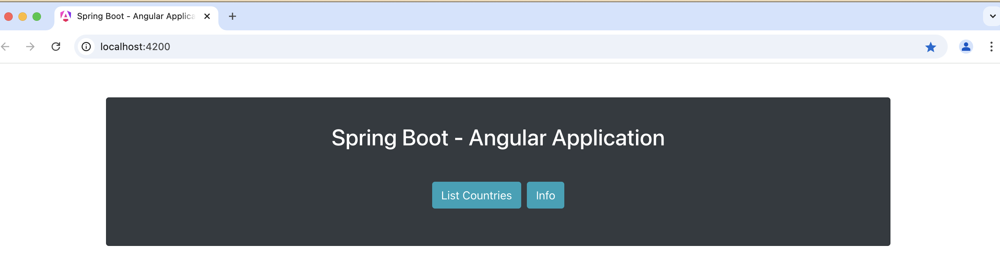

# How to run this application

#### This project was generated with [SpringBoot](https://github.com/angular/angular-cli) version 3.3.1 and [Java](https://github.com/angular/angular-cli) version 17.

### Pre-requisites
    
Open Terminal and verify Java 17 is installed using the command:

    $ java --version

## To run this application

    1. Open the build.gradle file in IntelliJ as project [IntelliJ IDEA 2024.1.4 (Community Edition)]
    2. Run configuration Basic
    3. Verify in logs that Server has started.
    4. Open the server at http://localhost:6600
        - Open the h2 db as http://localhost:6600/h2
        - Open Swagger at http://localhost:6600/swagger-ui/index.html

## To run Angular Client UI

### Pre-requisites

Open Terminal and verify node is installed using the command:

    $ node -v

Verify npm is installed using the command:

    $ npm -v

Verify angularcli is installed using the command:

    $ ng --version

Navigate to dir angularclient using command:

    $ cd angularclient

Verify if node_modules dir is present. If not run command:

    $ npm install

Run `ng serve` for a dev server. 
    
    $ ng serve

Navigate to `http://localhost:4200/`. Following page will be displayed.

Click on 'List of Countries' to get a Country list

Click on 'Basic Info' to get Info about this app.

The application will automatically reload if you change any of the source files.

## To run this application with Postgres DB

### Pre-requisites

Open Terminal and verify postgres is installed using the command:

    $ postgres --version

Verify postgres bin folder is in PATH

    $ export PATH=/Applications/Postgres.app/Contents/Versions/latest/bin:$PATH

Verify connection with postgres db using the command:

    $ psql -U postgres -d postgres

Verify if Country table is present using the command:

    postgres=# select * from country;

If table is not found, Run data.sql file using the command:

    $ psql -U postgres -d postgres < <absolute-path>/BasicDemo/src/main/resources/data.sql

Now, run the app from IntelliJ

    1. Open the build.gradle file in IntelliJ as project [IntelliJ IDEA 2024.1.4 (Community Edition)]
    2. Run configuration Basic-Postgres
    4. Open the server at http://localhost:6600
        - Open Swagger at http://localhost:6600/swagger-ui/index.html
        - Database will be available in psql:

        $ psql -U postgres -d postgres